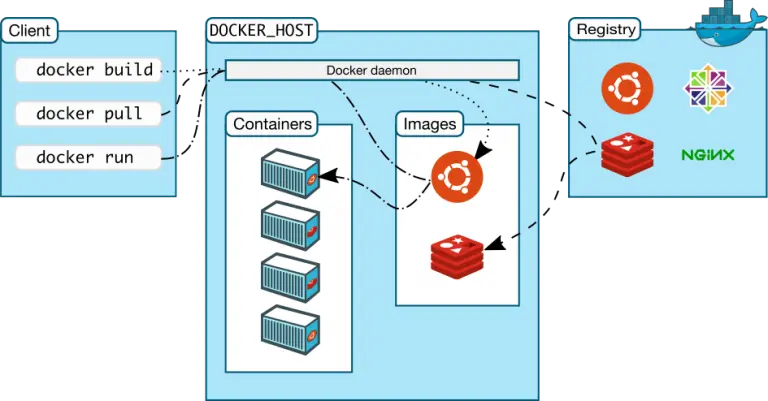
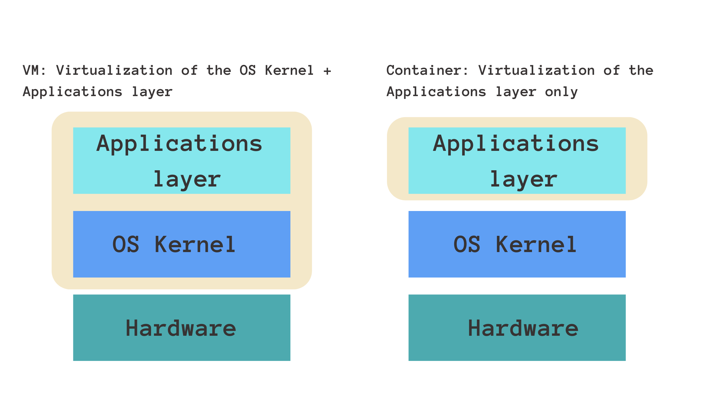
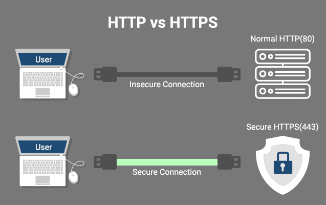
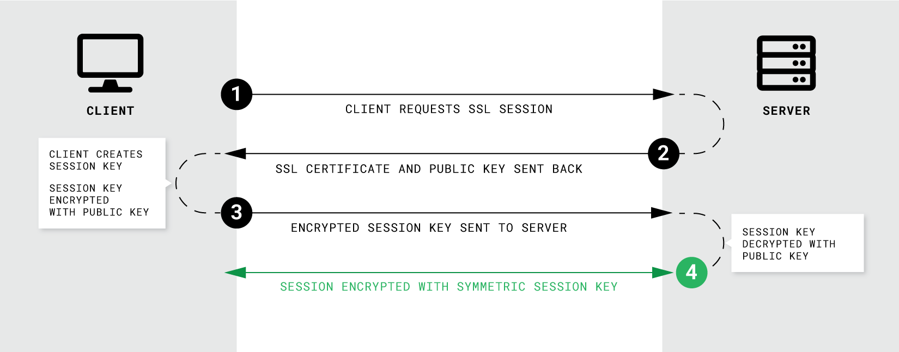
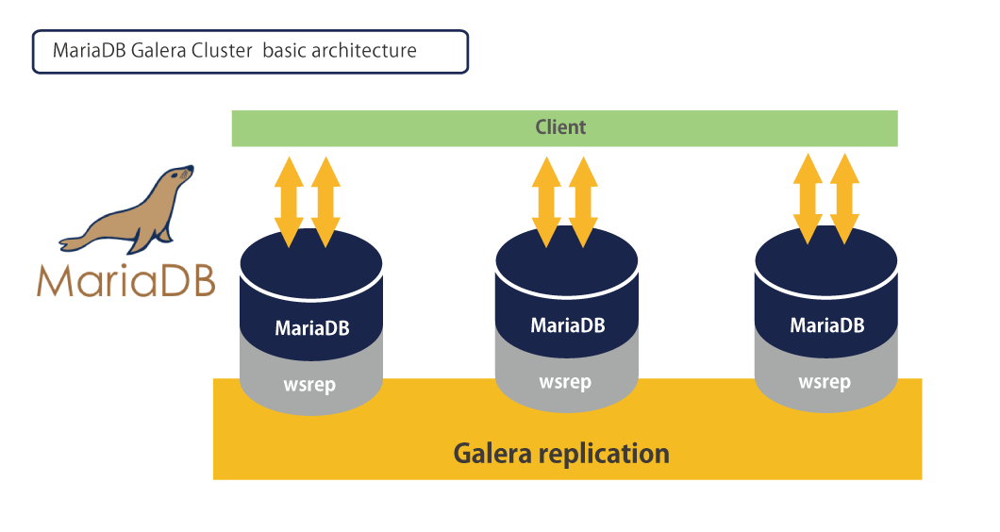
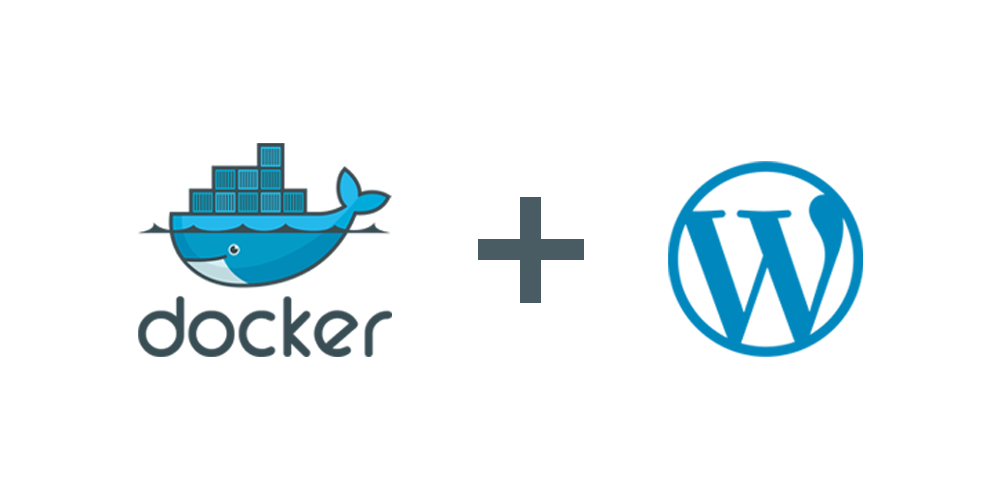
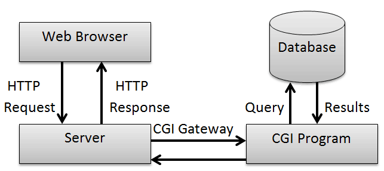
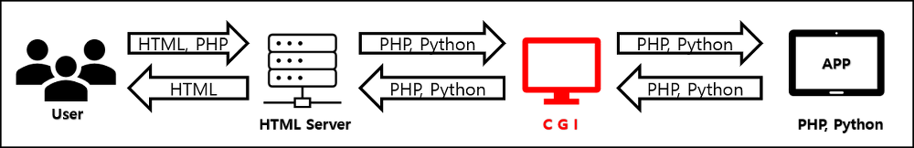

# inception (42 project)
## description

  Creating a docker-based WordPress LEMP stack using docker-compose on Alpine Linux or Debian Buster. The whole project has to be done in our personal virtual machine.
  Take look at subject for more info: [subject](https://github.com/Xperaz/inception/blob/main/en.subject.pdf).


## Index

* [Description](#description)
* [DOCKER](#docker)
    * [WHAT IS DOCKER](#what-is-docker)
    * [CONTAINER AND IMAGES](#containers-and-images)
    * [HOW DOCKER WORK](#how-docker-work)
    * [DOCKERFILES](#dockerfiles)
    * [LAYERS](#layers)

* [DOCKER COMPOSE](#docker-compose)
* [DOCKER VS DOCKER COMPOSE](#docker-vs-docker-compose)
* [DOCKER VS VIRTUAL MACHINE](#docker-vs-virtual-machine)
* [DOCKER NETWORKING](#docker-networking)
* [♻️ LEMP STACK](#lemp)
    * [NGINX](#nginx)
    * [MARIADB](#mariadb)
    * [Wordpress](#wordpress)
* [Project Flowchart](#flowchart)
* [Installation](#installation)
* [Ressources](#ressources)

# docker
  ## what is docker
  Docker is a popular open-source project written in go and developed by Dotcloud (A PaaS Company).

It is a container engine that uses the Linux Kernel features like namespaces and control groups to create containers on top of an operating system. So you can call it OS-level virtualization.

Docker is used to set up and deploy applications using containers. Docker’s environment streamlines the application development lifecycle, and Docker Compose, and advanced Docker tool, can be used to simplify your workflow.

  ## containers and images
  
  The basic structure of Docker relies on images and containers. We can think of a container as an object and an image as its class.

A container is an isolated system that holds everything required to run a specific application. It is a specific instance of an image that simulates the necessary environment. The following is an example command for running an Ubuntu Docker container and accessing the bash shell:
``` 
docker run -i -t ubuntu /bin/bash 
```
Images, on the other hand, are used to start up containers. From running containers, we can get images, which can be composed together to form a system-agnostic way of packaging applications.

Images can be pre-built, retrieved from registries, created from already existing ones, or combined together via a common network.

  ## how docker work
  
  ### docker component:
  <p align="center">
    
</p>

  Docker ecosystem is composed of the following four components

  1. Docker Daemon (dockerd)
  2. Docker Client
  3. Docker Images
  4. Docker Registries
  5. Docker Containers

  ### What is a Docker Daemon?
Docker has a client-server architecture. Docker Daemon (dockerd) or server is responsible for all the actions related to containers.

The daemon receives the commands from the Docker client through CLI or REST API. Docker client can be on the same host as a daemon or present on any other host.

By default, the docker daemon listens to the docker.sock UNIX socket. If you have any use case to access the docker API remotely, you need to expose it over a host port. One such use case is running Docker as Jenkins agents.

If you want to run Docker inside Docker, you can use the docker.sock from the host machine.

  ### what is docker client?
  Docker client provides a command-line interface (CLI) that allows users to run, and stop application commands to a Docker daemon.
  
  ### What is a Docker Registry?
It is a repository (storage) for Docker images.

A registry can be public or private. For example, Docker Inc provides a hosted registry service called Docker Hub. It allows you to upload and download images from a central location.

  ## dockerfiles
  
  Dockerfiles are how we containerize our application, or how we build a new container from an already pre-built image and add custom logic to start our application. From a Dockerfile, we use the Docker build command to create an image.

Think of a Dockerfile as a text document that contains the commands we call on the command line to build an image.

Below is an example of a Dockerfile:

```
FROM python:3
 
WORKDIR /usr/src/app
 
COPY requirements.txt ./
RUN pip install --no-cache-dir -r requirements.txt
 
COPY . .
 
CMD [ "python", "./your-daemon-or-script.py" ]

```

## layers

A Dockerfile works in layers. These are the building blocks of Docker. The first layer starts with the FROMkeyword and defines which pre-built image we will use to build an image. We can then define user permissions and startup scripts.

In Docker, a container is an image with a readable layer built on top of a read-only layer. These layers are called intermediate images, and they are generated when we execute the commands in our Dockerfile during the build stage.

## docker compose
**Docker Compose**: is a Docker tool used to define and run multi-container applications. With Compose, you use a YAML file to configure your application’s services and create all the app’s services from that configuration.

Think of docker-compose as an automated multi-container workflow. Compose is an excellent tool for development, testing, CI workflows, and staging environments. According to the Docker documentation, the most popular features of Docker Compose are:

- Multiple isolated environments on a single host
- Preserve volume data when containers are created
- Only recreate containers that have changed
- Variables and moving a composition between environments
- Orchestrate multiple containers that work together

## docker vs docker compose
As we discussed, a Dockerfile is a script that embodies instructions for building a Docker image. It stipulates the base image to use, the commands to run, and the files to copy into the image. After creating a Dockerfile, you can utilize the docker build command to build an image, which is then run as a container.

Meanwhile, Docker Compose is the tool we use for defining and running multi-container Docker applications. You can use it to define the services that make up your application, along with their configurations and dependencies, in a single file called docker-compose.yml.

Dockerfiles and Docker Compose play separate roles, but work in harmony to help streamline your DevOps workflow.

The Docker methodology is to write an appropriate Dockerfile for each image you need to create, then use Docker Compose to group the images together using the build command.

## docker vs virtual machine
Both virtual machines and containers help replicate the development environment, and manage dependencies and configurations better. But there are certain differences you should be aware of that will help you choose a VM or a Docker container depending on the application.

  ### 1️⃣ Virtualization
  
From our understanding thus far, both virtual machines and Docker containers provide isolated environments to run applications. The key difference between the two is in how they facilitate this isolation.
Recall that a VM boots up its own guest OS. Therefore, it virtualizes both the operating system kernel and the application layer.
A Docker container virtualizes only the application layer, and runs on top of the host operating system.

<p align="center">
    
</p>

### 2️⃣ Compatibility

A virtual machine uses its own operating system and is independent of the host operating system that it’s running on.  Therefore, a VM is compatible with all operating systems.

A Docker container, on the other hand, is compatible with any Linux distribution. You may run into some problems running Docker on a Windows machine or an older Mac.

### 3️⃣ Size

A Docker image is lightweight and is typically in the order of kilobytes.

💡 Note: A Docker image denotes the artifact containing the application, its associated dependencies, and configuration. A running instance of the Docker image is called a container.

A VM instance can be as large as a few gigabytes or even terabytes.

### 4️⃣ Performance

In terms of performance, Docker containers provide near-native performance. Because they are lightweight, you can start them in a few milliseconds.

Starting a VM is equivalent to setting up a standalone machine inside your computer. It can take as long as a few minutes to start a VM instance.

### 5️⃣ Security

Docker containers run on top of the host operating system. Therefore, if the host OS is susceptible to security vulnerabilities, so are the Docker containers.

Virtual machines, on the other hand, boot up their own operating system, and are more secure. Recall: each virtual machine is a fully blown machine running inside another. If you have stringent security constraints to be met for sensitive applications, you should consider using a virtual machine instead.

### 6️⃣ Replicability

The next factor we'll consider is the ease with which you can replicate the isolated environments provided by VMs and containers. We can infer the ease of replicability from our earlier discussions on size and performance.

When there are multiple applications, each of which should run on a VM instance, using VMs can be inefficient and resource intensive. Docker containers, by virtue of being lightweight and performant, are preferred when you need to run multiple applications. ✅

for more info: [Docker vs Virtual Machine (VM) – Key Differences You Should Know](https://www.freecodecamp.org/news/docker-vs-vm-key-differences-you-should-know/)<br>

## docker networking
[Docker Networking - Explore How Containers Communicate With Each Other](https://medium.com/edureka/docker-networking-1a7d65e89013)<br>
[Docker Networks — Part(1 of 2)](https://faun.pub/docker-networks-part-1-of-2-15a986a48d0a)<br>
[Docker Networks — Part(2 of 2)](https://faun.pub/docker-networks-part-2-of-2-8eaca9308456)<br>

## lemp
 ### 🤔 What’s a LEMP Stack ?
The subject requests us to create a LEMP stack :
- L stands for **Linux** as the operating system
- E for **Nginx** (pronounced as “Engine X”) as the web server
- M for **Mariadb** as the database
- P for **PHP** as a server-side scripting language that communicates with server and database
Every component of the stack communicates with each other :
<p align="center">
    
</p>


## nginx
    
<h3> 🔐 SSL / TLS </h3>
The **server certificate** is a public entity. It is sent to every client that connects to the server.

The **private key** is a secure entity and should be stored in a file with restricted access, however, it must be readable by nginx’s master process.



<p> <br/> <p/>

    - HTTP  : Hypertext Transfer Protocol

    - HTTPS : HTTP Secure (HTTPS) = HTTP over TLS/SSL

    - SSL   : Secure Sockets Layer

    - TLS   : Transport Layer Security = successor to SSL

<p align="center">
    <br/> <br/> <br/>
    
    <br/> <br/>
</p>

## mariadb


<p>
    <br/>
    MariaDB Server manages access to the MariaDB data directory that contains databases and tables. When MariaDB server starts, it listens for network connections from client programs and manages access to databases on behalf of those clients.

***mysqld*** is the actual MariaDB Server binary.

***mysqld_safe*** is the recommended way to start a mysqld server on Unix. mysqld_safe adds some safety features such as restarting the server when an error occurs and logging runtime information to an error log file.

***mysql_install_db*** initializes the MariaDB data directory and creates the system tables in the mysql database, if they do not exist.
</p>

<p align="center">
    <br/> <br/> <br/>
    
    <br/> <br/>
</p>

## wordpress
<p align="center">
<br/> <br/> <br/>


    <br/> <br/>
</p>

### php-fpm

Unlike Apache which can handle PHP processing directly, Nginx doesn't know how to run a PHP script of its own. It must rely on a separate PHP processor to handle PHP requests, like PHP-FPM.

PHP-FPM is a PHP-FastCGI Process Manager. It is a PHP language interpreter and manage php requests.

Nginx server will handle HTTP requests only, while PHP-FPM interprets the PHP code. When a user requests a PHP page the Nginx server will pass the request to PHP-FPM service using FastCGI porotocol. PHP-FPM runs outside the Nginx environment by creating its own process.

PHP-FPM can listen on Unix sockets or TCP sockets (that's what we use here).

### CGI and fastCGI
 #### Common Gateway Interface (CGI)

<br/> <br/> <br/>

<br/> <br/>
</p>

If you look at a website these days, a server with only HTML documents cannot run the site. HTML file management, high-speed data processing, user-entered data storage, etc. were impossible with a web server that processes static HTML files, and so it appeared. that is CGI.

CGI exists between these web servers (Nginx, Apache) and PHP and Python to transmit and process data to each other with standardized promises . It's possible.

<br/> <br/> <br/>

<br/> <br/>
</p>
In this CGI, if the information requested by the user is not a static HTML file, but a request comes from PHP or Python, the web server knows that it cannot process it and requests the PHP interpreter to read and process the PHP script written by the developer. The result is returned to the web server, which in turn returns it to the browser.

### Limitations of CGI

Now, as services get bigger and bigger, CGI is also reaching its limits.

CGI creates a process whenever it is requested, and while the process is running, it consumes system resources. Also, if many requests occur at the same time, the process is created and a load is generated on the server.

### Fast Common Gateway Interface (FastCGI)

It was inefficient on the server due to the load problem of CGI. As a solution, FastCGI is a technology that evolved CGI. It has been standard for over 20 years, and most web servers (Nginx, IIS, Apache) provide FastCGI function.

FastCGI handles multiple requests by creating one large process instead of creating a process for each request like the existing CGI.

In addition, it is possible to separate the web server and PHP by establishing a PHP server at the back end through socket communication with FastCGI. This is called WAS (Web Application Server) .

## flowchart
<br/> <br/> <br/>

<br/> <br/>
</p>

## installation
  1. Clone the Project folder:

      ```
       git clone https://github.com/Xperaz/inception.git
     ```
  2. accede to the folder:

     ```
       cd inception
     ```

  3. Build the images and deploy the infrastructure:

     ```
       make build
     ```

  4. Stop and remove containers, images, volumes and network:

     ```
       make clean
     ```

# Ressources

- [What is Docker? How Does it Work?](https://devopscube.com/what-is-docker/)<br>
- [Cgroups, namespaces, and beyond: what are containers made from?](https://www.youtube.com/watch?v=sK5i-N34im8&ab_channel=Docker)<br>
- [Containers vs. Virtual Machines](https://blogs.umass.edu/Techbytes/2018/10/09/what-is-docker-and-how-does-it-work/)<br>
- [Docker Tutorial for Beginners](https://www.youtube.com/watch?v=zJ6WbK9zFpI&ab_channel=KodeKloud)<br>
- [Explaining Docker Networking Concepts](https://ostechnix.com/explaining-docker-networking-concepts/)<br>
- [ Dockerfile tutorial by example - basics and best practices](https://takacsmark.com/dockerfile-tutorial-by-example-dockerfile-best-practices-2018)
- [Docker networking is CRAZY!!!](https://www.youtube.com/watch?v=bKFMS5C4CG0&ab_channel=NetworkChuck)<br>
- [How To Communicate Between Docker Containers](https://www.tutorialworks.com/container-networking/)<br>
 - [WordPress Deployment with NGINX, PHP-FPM and MariaDB using Docker Compose](https://medium.com/swlh/wordpress-deployment-with-nginx-php-fpm-and-mariadb-using-docker-compose-55f59e5c1a)
 - [How To Configure Nginx to use TLS 1.2 / 1.3 only](https://www.cyberciti.biz/faq/configure-nginx-to-use-only-tls-1-2-and-1-3/)
 - [How To Install MariaDB](https://www.digitalocean.com/community/tutorials/how-to-install-mariadb-on-ubuntu-20-04)
 -  [How to install WordPress Using wp-cli](https://blog.sucuri.net/2022/11/wp-cli-how-to-install-wordpress-via-ssh.html)
 - [Learn CGI and FastCGI](https://www.howtoforge.com/install-adminer-database-management-tool-on-debian-10/)
 - [How To Set Up vsftpd](https://www.digitalocean.com/community/tutorials/how-to-set-up-vsftpd-for-a-user-s-directory-on-ubuntu-20-04)
 - [install adminer](https://www.howtoforge.com/install-adminer-database-management-tool-on-debian-10/)

